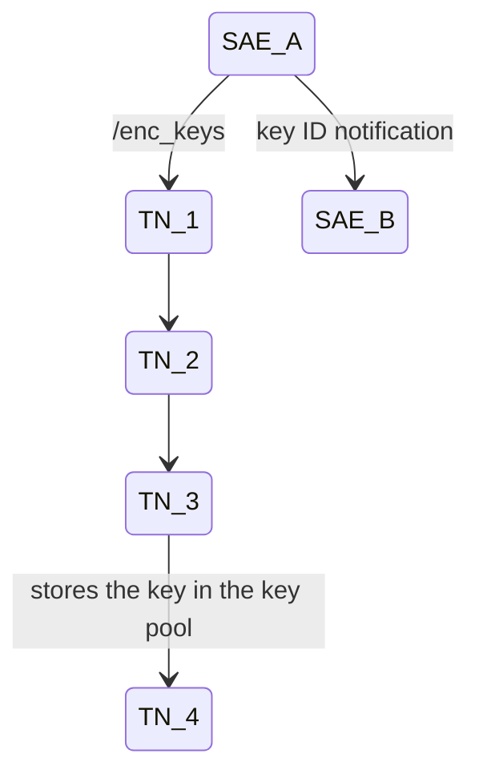
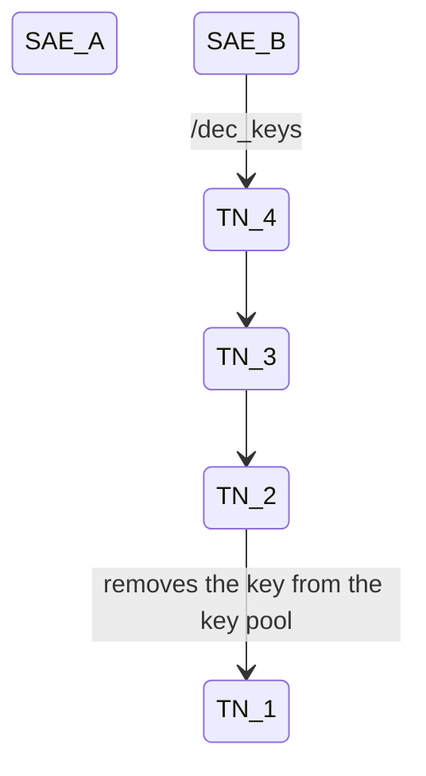
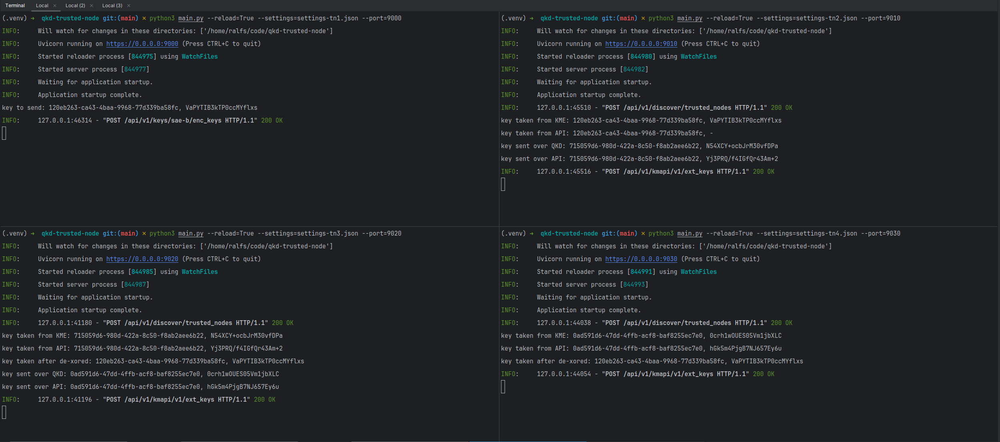
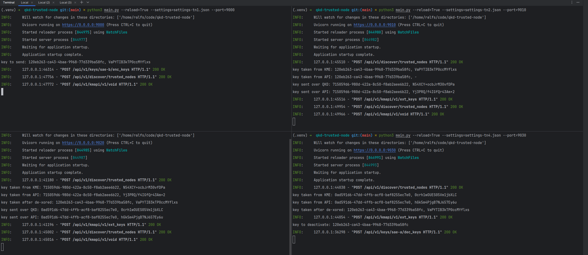
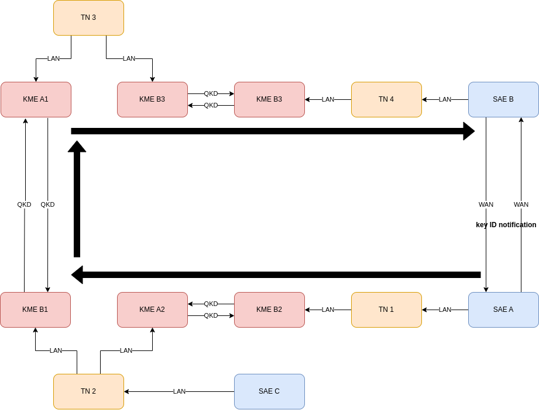

# Python QKD Trusted Node

This project builds upon the ETSI GS QKD 014 standard, which implements a "trusted node" functionality or, in different
words, something more
resembling a fully-fledged key management system (KMS).

## Abbreviations

For a full list, see the ETSI GS QKD 014 standard.
It is recommended, that you have prior knowledge of the ETSI GS QKD 014 standard, before trying to use this project.

- **SAE**: secure application entity
- **TN**: trusted node
- **KME**: key management entity
- **QKD**: quantum key distribution

## Introduction

This project's aim is to transform a regular QKD point-to-point network into a mesh-able network.
The trusted node implementation is a layer between the quantum layer and the application layer, working as a middleman.

The trusted node discovers other trusted nodes, KMEs and SAEs and uses the shortest path first algorithm (Dijkstra's
algorithm) to route the keys.

Once a path has been established, it calls synchronously the first trusted node, which then calls the next trusted node,
etc., in a synchronous fashion.

1st flow:



2nd flow:



The trusted nodes send and receive keys from the QKD devices, rather than sending them in plain text.
However, to later send the 1st key to the 2nd trusted node hop, it takes the 1st and the 2nd key and does an XOR
operation on the key.
This key is then sent over-the-wire to the trusted node. Then this trusted node then undoes this XOR and gets the 1st
key.

### Get encryption keys example



### Get decryption keys example



### Layers

In essence, there are 3 main layers of a quantum network:

1. Quantum level (physical QKD devices that are in a point-to-point configuration)
    1. They must implement an ETSI GS QKD 014 API interface in order to interface with this project
2. Key management system layer (_this project_)
3. Application layer (actual SAEs that work with this project, not directly with the QKD devices)

Best logical description of this project would be this image from ID Quantique:


This would be the Q-KMS layer.

### Inspiration

This project is inspired by, at the moment, in draft stage of ETSI GS QKD 020 standard, but does not fully follow
the standard. However, later someone should be able to make this project compatible with the standard, once released.

## Installation

1. `git clone https://github.com/next-door-key/qkd-trusted-node`
2. `cd qkd-trusted-node`
3. `python3 -m venv .venv`
4. `source .venv/bin/activate`
5. `pip install -r requirements.txt`
6. `./generate-certificates.sh`
7. Configure `docker-compose.yml` to build and
   start [QKD KME simulator](https://github.com/next-door-key/py-qkd-kme-sim)
8. `docker compose up -d`
9. `python3 main.py --reload=True --settings=settings-tn1.json --port=9000`

Remember to configure your HTTP clients to use the mutual TLS certificates, otherwise, you'll get a socket hangup
message.

## Configuration file

The project can be either configured from env variables or better from a settings.json file. There are 4 examples, that
are explained below.

### Description

```json
{
    "id": "tn-1-a2b2",
    // The SAE ID that is referenced for the QKD KMEs
    "server_cert_file": "certs/tn-1-a2b2.crt",
    // These certs and keys will be used to run the HTTPS server
    "server_key_file": "certs/tn-1-a2b2.key",
    "ca_file": "certs/ca.crt",
    // This is the global CA file that all certificates must use
    "min_key_size": 64,
    // Try to keep these all consistent with the KMEs and other TNs
    "max_key_size": 1024,
    "default_key_size": 128,
    "max_key_count": 50,
    "max_keys_per_request": 50,
    "attached_kmes": [
        // These are meant as those KMEs that are directly linked to this KME.
        // If the distance is 0, this means it is locally connected.
        // Distance = 1, means on the other side of the QKD device.
        // Any more is not recommended, because they will be auto discovered by the TNs themselves. 
        {
            "url": "https://localhost:8030",
            "kme_id": "ndk-kme-a2",
            "linked_to": "ndk-kme-b2",
            // To which other KME is this linked to (point-to-point other end)
            "kme_cert": "certs/kme-a2.crt",
            // The certificate that will be validated against, to make sure it is the right KME
            "sae_cert": "certs/tn-1-a2b2.crt",
            // This is the certificate and key to be used, when making requests to the KME
            "sae_key": "certs/tn-1-a2b2.key",
            "distance": 1
            // See above explanation, 0 = is local, 1 = is 1 hop away
        },
        {
            "url": "https://localhost:8040",
            "kme_id": "ndk-kme-b2",
            "linked_to": "ndk-kme-a2",
            "kme_cert": "certs/kme-b2.crt",
            "sae_cert": "certs/tn-1-a2b2.crt",
            "sae_key": "certs/tn-1-a2b2.key",
            "distance": 0
        }
    ],
    "attached_saes": [
        // These are the SAEs that connect to our trusted node and interact with the QKD 014 REST API
        {
            "sae_id": "sae-a",
            "sae_cert": "certs/sae-a.crt"
            // Certificate to validate against
        }
    ],
    "attached_trusted_nodes": [
        // These are the trusted nodes that are "directly" linked to this trusted node.
        // For a better understanding, see the example configuration chapter.
        {
            "url": "https://localhost:9010",
            "id": "tn-2-a2b1",
            "cert": "certs/tn-1-a2b2.crt",
            // The certificate and key to use, when making the requests
            "key": "certs/tn-1-a2b2.key"
        }
    ]
}
```

## Example configuration

The project is configurable via settings.json files and are configured to interact with a Docker network of simulated
QKD devices ([see the QKD simulator project](https://github.com/next-door-key/py-qkd-kme-sim)).

In total, there are 3 SAEs, 4 trusted nodes and 3 QKD links (3*2=6 QKD devices). See the below diagram for a topology
overview.



### Data flow (overview)

1. SAE A --> TN 1: `/api/v1/keys/sae-b/enc_keys`
2. TN 1 --> KME B2: `/api/v1/keys/tn-2-a2b2/enc_keys`
3. TN 1 --> TN 2: `/api/v1/kmapi/v1/ext_keys`
4. TN 2 --> KME A2: `/api/v1/keys/tn-1-a2b2/dec_keys`
5. <cycle then repeats with TN 2 moving to the next chain of KMEs and TNs>

## Security

It is possible to make this project more secure, but the intended goal of this project, more as a proof-of-concept, was
not to create a
production-ready system.

The authors take no responsibility of the completeness of the security mechanisms developed in the project.

However, if you would like to get in touch about any security issues, please
e-mail [security@garkaklis.com](mailto:security@garkaklis.com), instead of using the issue tracker.

## Credits

- [Ralfs Garkaklis](https://github.com/CreepPork)
- [Leo Trukšāns](https://github.com/leotruit)

## Disclaimer

This project originally has been developed for LatQN (Latvian National Quantum Network) project in association with
LVRTC (Latvian State Radio and Television Center).

## Licence

The project is licenced under
the [GNU Affero General Public Licence Version 3](https://github.com/next-door-key/py-qkd-kme-sim/blob/master/LICENSE).
